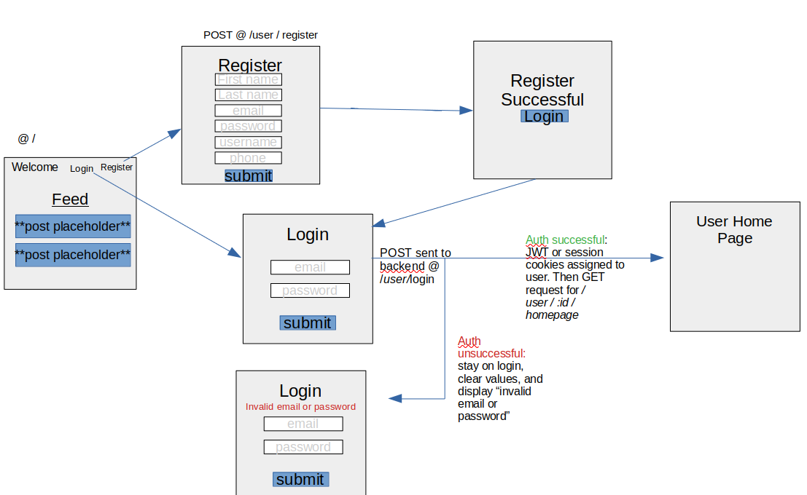
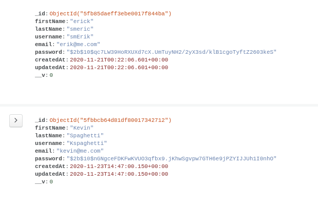
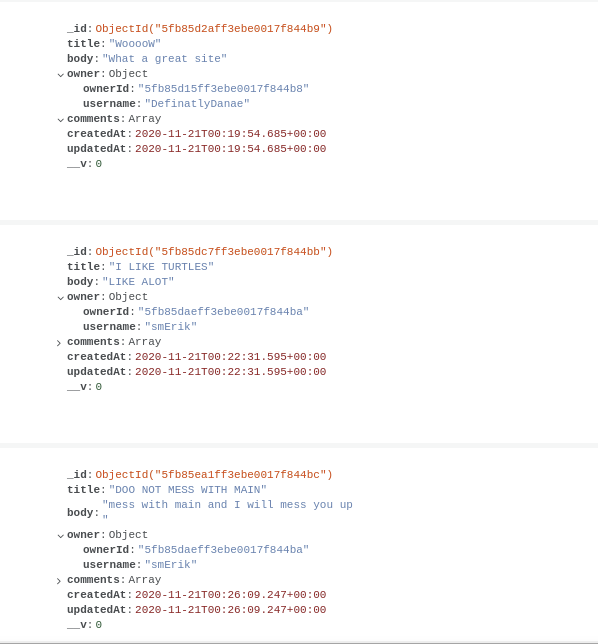

## Overview
Orange is social media platform that allows users to share what they are thinking via short blurps of text displayed on a message-board! The Orange backend handles and stores login and registration requests, user info, authentication, authorization and post data. View the frontend repo here : https://github.com/Team-Orange4/orange-frontend

## Original Wireframe

## Instillation Steps
1. Fork and clone this repo
2. Cd into the project directory
3. Install project dependencies by running npm i 
4. Create a new feature branch and start working!

## Technologies
- NodeJs
- Express
- Bcrypt
- JWT
- MongoDB
- Mongoose 

## Deployment Link
http://team-orange4.herokuapp.com/

## MongoDB
### Why Mongodb
We chose to use MongoDB, a schema-less NoSQL database, as our database because of how extremely flexible and forgiving it is. With less than a week to imagine, layout, and construct this full stack project, we knew there would be a lot of modifications along the way. Structural changes can be very tricky to handle with SQL base databases but with Mongo anything goes.  With the use of Mongoose and some models/schemas, we are quickly able to add a layer of data validation and structure onto or project without sacrificing an ease of use or flexibility. 
### Users Collection Screenshot

### Post Collection Screenshot

## Authentication and Authoriation
**Disclaimer:** *This project is still in development and we would not allow it to be deployed in market until all reasonable security and accessibility issues were resolved.  Security and accessibility are non negotiable essentials to any project. We as developer have a responsibility to make our applications as accessible as possible.  When as a company or developer we choose to store user data, we are now obligated to protect it. We are also obligated to disclose what information is stored pertaining to users and how we use that data to our users.*

No only did we need authentication and authorization to help secure site features, we also needed it to connect users actions on the site with their account. HTTP protocol like UDP protocol is stateless. This means the client and server sides are completely in-depended. The server does not keep track of anything happening on the client side and vice versa. If the client want the server to know any unique information about the client, it must be sent over in the HTTP request. This is one reason we needed authentication. By storing some piece of information on the client side and sending it to the server side on every request, we are able to determine what user performed the action. With out this we would not have an effective or practical way to tie users to the comments they made. 

### Json Web Tokens VS Session
Json Web Tokens, JWT, and sessions are great solutions to some of the issues the HTTP stateless protocol creates. We chose JWT over sessions because it does not require storing any information on the server. The JWT tokens themselves hold all the information about the user within the token itself. This means multiple servers/platforms can validate one token if they have the same key. Also if you accidentally publish your JWT to a public site like we did, you can simply create a new key and remove the old key. This invalidates all previous token!  JWT tokens are also resistant to tampering. The data content is used to create the token, so if the data is modified the token is no-longer valid. All these pluses are great but like anything their are some draw backs. If any one got a hold of your JWT token they could decrypt it with something like https://jwt.io/ and reveal all the information it stored. One plus of the session based approach is that it can add an extra layer of privacy. Instead of storing all the info on the client side. An Id can be stored on the client side that is used to query a db on the server. If someone retrieved a session id it itself contains little or no direct info about the user. Either way this leads us to the next section! DON'T STORE PLAIN TEXT PASSWORDS IN YOUR DB!

 * *image from jwt.io*

### Passwords and Bycrpt
This should be pretty obvious but it is not responsible or acceptable to store users passwords in plain text. Great tools like bcrypt exist that can relatively quickly hash passwords. Data breaches happen daily.  Their is no justifiable reason to put your users and company at risk by storing plain text passwords. Hashing and requiring a password of a minimum length and complexity are easy to implement and greatly increase security for your users.

## Some Wanted/Needed Additions 
- User profile page
- User setting page
- Post hashtags
- Likes data component
- JWT expiration and refresh tokens
- Email and username checker to confirm they are not already used in our database
- Email verification to confirm user's email
- Email scoring to flag suspicious accounts that are created
- Inappropriate language scanner 
- And much more!

## How to Contribute 
All contributions are appreciated!
1. Push your most recent development branch up to Github
2. Create a pull request against the branch of interest or our Dev branch.
3. Be descriptive in you pull message!
4. Await merge or revision request!

## Many thanks to: 
- General Assembly and their amazing instructors and IAs for helping us in our software engineering journey! You are all fantastic and we have enjoyed every step of the process. I don't know how you GA retain such amazing staff! https://generalassemb.ly/
- Github for being a invaluable resource to the open source community
- Countless other developers on quora, stack-overflow, YouTube, etc! Keep on contributing. It is appreciated. 

